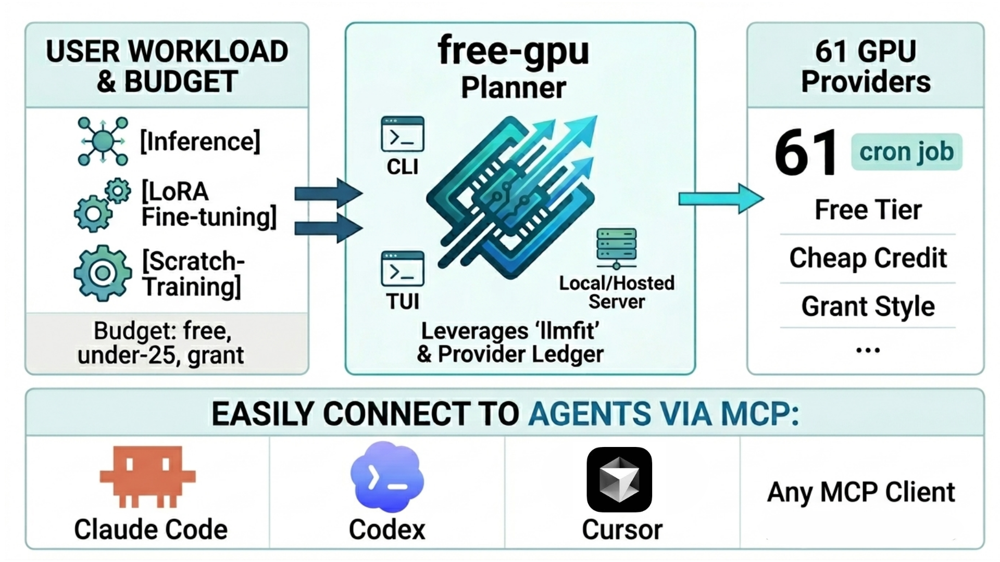
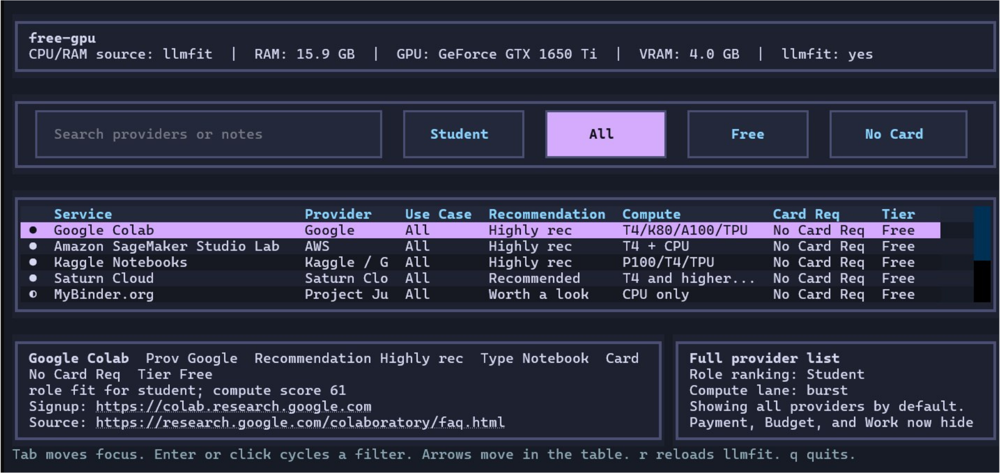

<p align="center">
  
</p>

<h1 align="center">free-gpu</h1>

<p align="center"><strong>Plan local-first experiments and get more from free GPU providers.</strong></p>

<p align="center">
  See what fits on your hardware first, then use free or near-free GPU providers for the runs that should not stay local.
</p>

<p align="center">
  <a href="https://francescoopiccolo.github.io/free-gpu/">Website</a> |
  <a href="https://pypi.org/project/free-gpu/">PyPI</a> |
  <a href="./free_gpu/gpu_compute_database.csv">Dataset</a> |
  <a href="https://free-gpu.vercel.app/mcp">Hosted MCP</a>
</p>

<p align="center">
  
  
  
</p>

---

<p align="center">
  
</p>

`free-gpu` sits on top of [`llmfit`](https://www.llmfit.org/) and maps a workload to a practical path: stay local when your machine can carry it, then move to free tiers, credits, or grant-style compute only when the workload really needs it.

## Table of Contents

- [What it does](#what-it-does)
- [Add to your MCP client](#add-to-your-mcp-client)
- [Quick start](#quick-start)
- [How it works](#how-it-works)
- [Provider data](#provider-data)
- [Project links](#project-links)

## What it does

- Checks whether a workload is realistic on your local hardware through `llmfit`.
- Ranks provider lanes across `free`, `under-25`, and `grant` budgets.
- Plans common workloads such as `inference`, `finetune-lora`, `batch-eval`, and `agent-loop`.
- Exposes the same planner through a CLI, a TUI, a local MCP server, and a hosted MCP endpoint.

## Add to your MCP client

<details>
<summary><strong>Codex</strong></summary>

Hosted:

```bash
codex mcp add freeGpu --url https://free-gpu.vercel.app/mcp
```

Local:

```bash
codex mcp add free-gpu-local -- free-gpu-mcp
```

</details>

<details>
<summary><strong>Claude Code</strong></summary>

Hosted:

```bash
claude mcp add --transport http free-gpu https://free-gpu.vercel.app/mcp
```

Local:

```bash
claude mcp add --transport stdio free-gpu -- free-gpu-mcp
```

</details>

<details>
<summary><strong>Cursor</strong></summary>

Hosted:

```json
{
  "mcpServers": {
    "free-gpu": {
      "url": "https://free-gpu.vercel.app/mcp"
    }
  }
}
```

Local:

```json
{
  "mcpServers": {
    "free-gpu": {
      "command": "free-gpu-mcp"
    }
  }
}
```

</details>

<details>
<summary><strong>VS Code</strong></summary>

Hosted:

```json
{
  "servers": {
    "freeGpu": {
      "type": "http",
      "url": "https://free-gpu.vercel.app/mcp"
    }
  }
}
```

Local:

```json
{
  "servers": {
    "freeGpu": {
      "type": "stdio",
      "command": "free-gpu-mcp"
    }
  }
}
```

</details>

## Quick start

### Install

```bash
pip install free-gpu
```

### Open the TUI

```bash
free-gpu ui
```

### Ask the planner from the CLI

```bash
free-gpu providers --workload inference --budget free
free-gpu plan --workload finetune-lora --model llama-3.1-8b --budget under-25 --task-hours 6 --min-vram-gb 16
free-gpu plan --workload scratch-train --budget grant --task-hours 24 --min-vram-gb 40
```

The LoRA fine-tuning example above is the core workflow: describe the model, define the workload, add a budget lane, and let the planner narrow down the realistic path.

## How it works

<p align="center">
  
</p>

1. Start with the workload shape: model, hours, VRAM target, and budget lane.
2. Check whether the run is realistic on your own machine through `llmfit`.
3. Rank providers only after the local fit is known.
4. Return a practical next step instead of making you browse pricing pages and free-tier docs manually.

## Provider data

The provider ledger lives in [`free_gpu/gpu_compute_database.csv`](./free_gpu/gpu_compute_database.csv).

## Project links

- Repository: <https://github.com/francescoopiccolo/free-gpu>
- Website: <https://francescoopiccolo.github.io/free-gpu/>
- PyPI: <https://pypi.org/project/free-gpu/>
- Dataset: [`free_gpu/gpu_compute_database.csv`](./free_gpu/gpu_compute_database.csv)
- Hosted MCP: <https://free-gpu.vercel.app/mcp>
